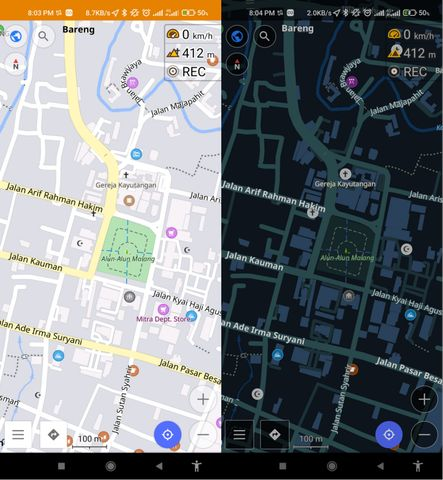

# phmap-osmand

OsmAnd custom rendering style and routing. Currently, we have two styles variant available at the moment and one custom routing for car.

# Rendering Style Installation

1. Put the *.render.xml file in **/storage/emulated/0/Android/data/net.osmand.plus/files/rendering/** for OsmAnd plus or **/storage/emulated/0/Android/data/net.osmand/files/rendering/** for OsmAnd App.
2. Open OsmAnd app and select **Configure Map > Map rendering > Map style** than select **Pranatahouse** or **Phmaps**.

# Custom Routing Installation

1. Put the routing.xml file in **/storage/emulated/0/Android/data/net.osmand.plus/files/routing/** for OsmAnd plus or **/storage/emulated/0/Android/data/net.osmand/files/routing/** for OsmAnd App.
2. Open OsmAnd app and select **Driving Profile > Configure profile > navigation settings > Navigation type > Offline > routing.xml** than select **phcar**.
